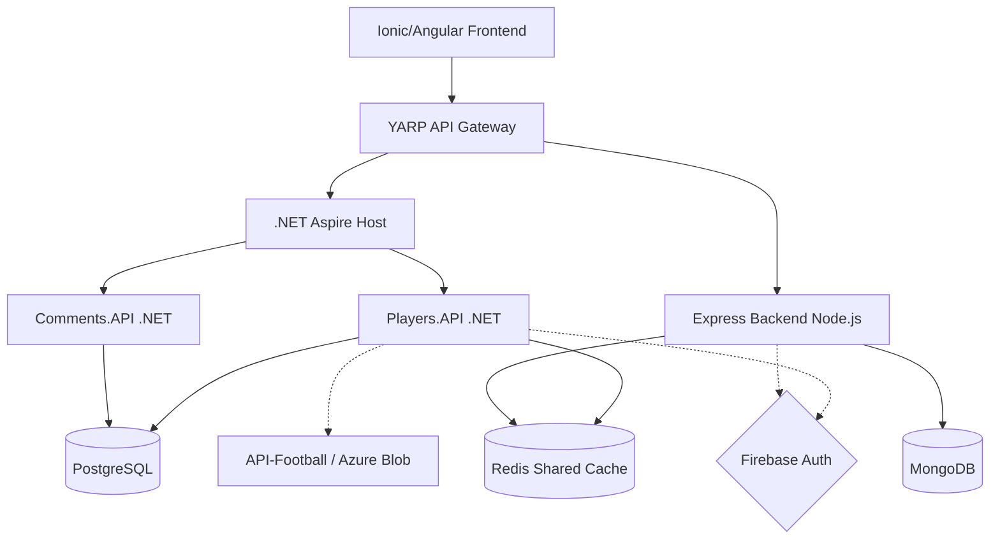

# FootballManagerApp ⚽

Plataforma integral de alto rendimiento para la gestión de jugadores y estadísticas de fútbol, diseñada con una arquitectura de microservicios distribuida y políglota.


---

## Descripción

FootballManagerApp permite la búsqueda, importación y gestión de perfiles de jugadores profesionales utilizando APIs externas y almacenamiento local persistente. El sistema ofrece visualización de estadísticas avanzadas, gestión de noticias en tiempo real y generación de alineaciones mediante Inteligencia Artificial.

### Contexto Académico

Este proyecto se desarrolla como una solución unificada para las siguientes asignaturas del Máster en Ingeniería Informática (UAL):

| Asignatura | Siglas | Enfoque Principal |
|------------|--------|-------------------|
| Desarrollo Web en el Servidor Cliente | **DWSC** | Backend .NET, Microservicios y Orquestación con Aspire |
| Tecnologías de Red y Web Móvil | **TRWM** | Backend Node.js, Patrón TRWM y MongoDB |
| Desarrollo de Aplicaciones Híbridas | **DAH** | Frontend móvil/web con Ionic, Angular y Capacitor |
| Diseño de Sistemas Software | **DSS** | Arquitectura, Patrones de Diseño y Calidad |

---

## Arquitectura

El sistema utiliza un patrón de microservicios orquestados, con un punto de entrada unificado mediante un Gateway.



---

## Stack Tecnológico

| Capa | Tecnologías |
|------|-------------|
| **Frontend** |    |
| **API Gateway** |   |
| **Backend .NET** |    |
| **Backend Node** |    |
| **Persistencia** |    |
| **DevOps & Cloud** |    |

---

## Estructura del Repositorio

```text
/FootballManagerApp
├── /backend-node              # Backend Express + MongoDB (TRWM)
│   ├── /src/controllers       # Controladores de la API
│   ├── /src/models           # Esquemas de Mongoose
│   └── /tests                # Pruebas unitarias con Jest
├── /frontend                  # Cliente Ionic + Angular (DAH)
│   ├── /src/app/core         # Servicios globales e interceptores
│   └── /src/app/features     # Módulos de funcionalidad (jugadores, noticias)
└── /src/FootballManagerApp    # Ecosistema .NET (DWSC)
    ├── /AppHost               # Orquestador .NET Aspire
    ├── /Gateway               # YARP API Gateway
    ├── /Players.API           # Microservicio de Jugadores (PostgreSQL)
    └── /Comments.API          # Microservicio de Comentarios
```

---

## Cómo ejecutar en local

### Prerrequisitos
- **.NET SDK**: 10.0+
- **Node.js**: 20.x+
- **Docker Desktop**: Con soporte para contenedores Linux
- **Angular CLI**: 17.x+
- **Ionic CLI**: 7.x+

### Pasos

1. **Clonar el repositorio**
   ```bash
   git clone https://github.com/JohanCalaT/FootballManagerApp.git
   cd FootballManagerApp
   ```

2. **Configurar variables de entorno**
   Copia los archivos `.env.example` a `.env` en las carpetas correspondientes y añade tus credenciales de Firebase y API-Football.

3. **Ejecutar con .NET Aspire** (Recomendado)
   ```bash
   cd src/FootballManagerApp/FootballManagerApp.AppHost
   dotnet run
   ```
   Esto levantará automáticamente las bases de datos (PostgreSQL, MongoDB, Redis) en contenedores y todos los microservicios.

4. **Acceder al Dashboard**
   Aspire proporcionará una URL (normalmente `http://localhost:15000`) donde podrás ver el estado de todos los servicios y sus logs.

---

## CI/CD y Despliegue

### Flujo de Trabajo (GitFlow)
- **`main`**: Rama protegida para producción. Solo acepta merges desde `develop`.
- **`develop`**: Rama base para integración (Staging).
- **`feature/*`**: Ramas para el desarrollo de nuevas características.

### Entornos de Despliegue

| Entorno | Rama | Hosting | URL |
|---------|------|---------|-----|
| **Producción** | `main` | Azure Container Apps | `https://footballmanager.azureapps.io` |
| **Staging** | `develop` | Azure Container Apps | `https://footballmanager-staging.azureapps.io` |

---

## Testing

| Capa | Framework | Tipo de Tests |
|------|-----------|---------------|
| **Backend .NET** | xUnit / NUnit | Unitarios, Integración |
| **Backend Node** | Jest | Unitarios (Servicios/Controllers) |
| **Frontend** | Karma / Jasmine | Unitarios de Componentes |
| **E2E** | Cypress | Flujos de usuario completos |

---

**Johan Cala — Máster en Ingeniería Informática, UAL**
